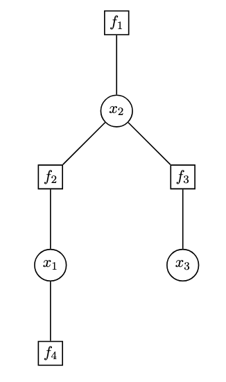
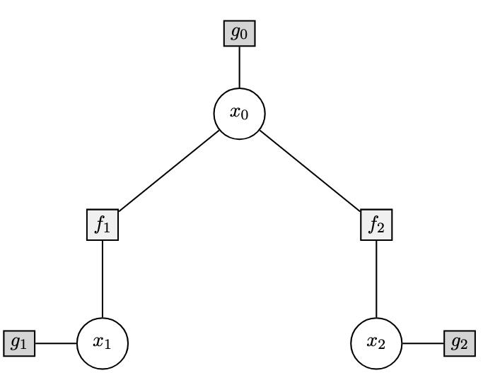

# Introduction
Efficient inference on models represented by large, dynamic, and highly inter-connected graphs is challenging.

# Belief Propagation (BP)
**Belief Propagation** is an algorithm used for calculating the marginals of a joint distribution via local message passing between nodes in a **factor graph**.

## Factor Graphs
Factor graphs are a type of bipartite graphical model that connects variables via factors. These factors represent the local dependencies between the variables.

## Performance and Convergence
- **Tree-structured graphs:** BP is exact.
- **Loopy graphs:** BP is an approximation but empirically produces high-quality results.

# Gaussian Belief Propagation (GBP)
GBP specifically addresses cases where the distributions are Gaussian. Key characteristics include:
- **Linear Systems:** GBP is closely linked to solving linear systems. (Why ???, Schur's complement)
- **Extensions:** Handling non-linearities and non-Gaussian data. (Just the laplace approximation)

# Mathematical Foundation
According to the **Hammersley-Clifford Theorem**, the joint probability distribution factorizes as:
$$ p(X) = \prod_{i} f_i(X_i) $$

## Example Factor Graph
For a system with variables $x_1, x_2, x_3$, the joint distribution is:
$$ p(x_1, x_2, x_3) = f_1(x_1) f_2(x_2) f_3(x_1, x_2) f_4(x_2, x_3) $$

{fig-align="center" width=50%}

# BP Equations

Factors are basically all the independent factors that appear in the joint distribution. 

**Factor to Variable Message: Product of all messages from all variable nodes except $i$ to the factor node $f_j$ times the factor and then integrate out all the $x_j$ except $x_i$**
$$ m_{f_j \to x_i} = \sum_{x_{j \setminus i}} \left( \prod_{k \in N(j) \setminus i} m_{x_k \to f_j} \right) (f_j(x_j)) $$

**Variable to Factor Message: Product of all messages incoming to the variable except from the factor the message is being sent to**
$$ m_{x_i \to f_j} = \prod_{s \in N(i) \setminus j} m_{f_s \to x_i} $$

**Belief Update: Product of all messages incoming to a variable**
$$ b_i(x_i) = \prod_{s \in N(i)} m_{f_s \to x_i} $$

# Gaussian Forms
**Moments Form:**
$$ E(x) = \frac{1}{2}(x-\mu)^T \Sigma^{-1} (x-\mu) $$

**Canonical Form:**
$$ E(x) = \frac{1}{2}x^T \Lambda x - \eta^T x $$
Where $\Lambda = \Sigma^{-1}$ (Precision) and $\eta = \Sigma^{-1}\mu$ (Information vector).

# Doing the derivation for a small example tree.

{fig-align="center" width=100%}

## Message Passing Equations

### 1. Leaf to Variable Messages
The messages from the evidence factors $g_1$ and $g_2$ to the variable nodes are given by Gaussians:
$$ m_{g_2 \to x_2} = \mathcal{N}(x_2 | \mu_2, \sigma_2^2) $$
$$ m_{g_1 \to x_1} = \mathcal{N}(x_1 | \mu_1, \sigma_1^2) $$

### 2. Variable to Factor Messages
Since $x_1$ and $x_2$ only have one incoming message from the leaves:
$$ m_{x_1 \to f_1} = m_{g_1 \to x_1} $$
$$ m_{x_2 \to f_2} = m_{g_2 \to x_2} $$

### 3. Factor to Variable Messages (Marginalization)
The messages from factors $f_1$ and $f_2$ to the root node $x_0$ are computed by integrating out the leaf variables:
$$ m_{f_2 \to x_0} = \int f_2 \cdot m_{x_2 \to f_2} \, dx_2 $$
$$ m_{f_1 \to x_0} = \int f_1 \cdot m_{x_1 \to f_1} \, dx_1 $$

## Evaluation of the Integrals

Taking the message $m_{f_2 \to x_0}$ as an example:
$$ m_{f_2 \to x_0} = \int \frac{1}{\sqrt{2\pi t_2 v}} e^{-\frac{1}{2}\frac{(x_0 - x_2)^2}{t_2 v}} \frac{1}{\sqrt{2\pi \sigma_2^2}} e^{-\frac{1}{2}\frac{(x_2 - \mu_2)^2}{\sigma_2^2}} \, dx_2 $$

Solving the Gaussian convolution (completing the square), we get:

$$ \int \frac{1}{\sqrt{2\pi t_2 v}} e^{-\frac{1}{2} \frac{(x_0 - x_2)^2}{t_2 v}} \frac{1}{\sqrt{2\pi \sigma_2^2}} e^{-\frac{1}{2} \frac{(x_2 - \mu_2)^2}{\sigma_2^2}} dx_2 $$
$$ = \frac{1}{2\pi} \times \frac{1}{\sqrt{t_2 v}} \times \frac{1}{\sqrt{\sigma_2^2}} \exp \left[ -\frac{1}{2} \left[ \frac{x_0^2}{t_2 v} + \frac{x_2^2}{t_2 v} - \frac{2x_0 x_2}{t_2 v} + \frac{x_2^2}{\sigma_2^2} + \frac{\mu_2^2}{\sigma_2^2} - \frac{2x_2 \mu_2}{\sigma_2^2} \right] \right] $$
$$ = \frac{1}{2\pi \sqrt{t_2 v \sigma_2^2}} e^{-\frac{1}{2} \left[ x_2^2 \left( \frac{1}{t_2 v} + \frac{1}{\sigma_2^2} \right) - 2x_2 \left[ \frac{x_0}{t_2 v} + \frac{\mu_2}{\sigma_2^2} \right] + \frac{x_0^2}{t_2 v} + \frac{\mu_2^2}{\sigma_2^2} \right]} $$
$$ = \frac{1}{2\pi \sqrt{t_2 v \sigma_2^2}} e^{-\frac{1}{2} \left( \frac{1}{t_2 v} + \frac{1}{\sigma_2^2} \right) \left[ x_2^2 - 2x_2 \left( \frac{\frac{x_0}{t_2 v} + \frac{\mu_2}{\sigma_2^2}}{\frac{1}{t_2 v} + \frac{1}{\sigma_2^2}} \right) + \frac{\frac{x_0^2}{t_2 v} + \frac{\mu_2^2}{\sigma_2^2}}{\frac{1}{t_2 v} + \frac{1}{\sigma_2^2}} \right]} $$
$$ = \frac{1}{2\pi \sqrt{t_2 v \sigma_2^2}} e^{-\frac{1}{2} \left( \frac{1}{t_2 v} + \frac{1}{\sigma_2^2} \right) \left[ \left( x_2 - \frac{\left( \frac{x_0}{t_2 v} + \frac{\mu_2}{\sigma_2^2} \right)}{\frac{1}{t_2 v} + \frac{1}{\sigma_2^2}} \right)^2 + \frac{\frac{x_0^2}{t_2 v} + \frac{\mu_2^2}{\sigma_2^2}}{\frac{1}{t_2 v} + \frac{1}{\sigma_2^2}} - \left( \frac{\frac{x_0}{t_2 v} + \frac{\mu_2}{\sigma_2^2}}{\frac{1}{t_2 v} + \frac{1}{\sigma_2^2}} \right)^2 \right]} $$
$$ = \frac{1}{2\pi \sqrt{t_2 v \sigma_2^2}} e^{-\frac{1}{2} \left( \frac{1}{t_2 v} + \frac{1}{\sigma_2^2} \right) \left( x_2 - \frac{\left( \frac{x_0}{t_2 v} + \frac{\mu_2}{\sigma_2^2} \right)}{\frac{1}{t_2 v} + \frac{1}{\sigma_2^2}} \right)^2} e^{-\frac{1}{2} \left[ \left( \frac{x_0^2}{t_2 v} + \frac{\mu_2^2}{\sigma_2^2} \right) - \frac{\left( \frac{x_0}{t_2 v} + \frac{\mu_2}{\sigma_2^2} \right)^2}{\frac{1}{t_2 v} + \frac{1}{\sigma_2^2}} \right]} $$
$$ = \frac{1}{2\pi \sqrt{t_2 v \sigma_2^2}} \times \sqrt{\frac{2\pi}{\frac{1}{t_2 v} + \frac{1}{\sigma_2^2}}} \times e^{-\frac{1}{2} \left[ \frac{x_0^2}{t_2 v^2} + \frac{\mu_2^2}{\sigma_2^4} + \frac{x_0^2}{t_2 \sigma_2^2} + \frac{\mu_2^2}{\sigma_2^2 t_2 v} - \frac{x_0^2}{t_2 v^2} - \frac{\mu_2^2}{\sigma_2^4} - \frac{2x_0 \mu_2}{t_2 v \sigma_2^2} \right] / \left( \frac{1}{t_2 v} + \frac{1}{\sigma_2^2} \right)} $$
$$ = \frac{1}{\sqrt{2\pi (t_2 v + \sigma_2^2)}} e^{-\frac{1}{2} \frac{(x_0 - \mu_2)^2}{(\frac{1}{t_2 v} + \frac{1}{\sigma_2^2})(t_2 v \sigma_2^2 )}} $$
$$ = \frac{1}{\sqrt{2\pi (t_2 v + \sigma_2^2)}} e^{-\frac{1}{2} \frac{(x_0 - \mu_2)^2}{t_2 v + \sigma_2^2}} $$

$$ m_{f_2 \to x_0} = \frac{1}{\sqrt{2\pi (\sigma_2^2 + t_2 v)}} e^{-\frac{1}{2} \frac{(x_0 - \mu_2)^2}{t_2 v + \sigma_2^2}} $$

Similarly for $m_{f_1 \to x_0}$:
$$ m_{f_1 \to x_0} = \frac{1}{\sqrt{2\pi (\sigma_1^2 + t_1 v)}} e^{-\frac{1}{2} \frac{(x_0 - \mu_1)^2}{t_1 v + \sigma_1^2}} $$

## Partition Function and Total Probability

The partition function $Z$ (which equals the probability of the data $P(D)$) is the integral over $x_0$, assuming $m_{g_0 \to x_0}$ is uniform. 
$$ Z = P(D) = \int m_{f_2 \to x_0} \cdot m_{f_1 \to x_0} \cdot m_{g_0 \to x_0} \, dx_0 $$

$$ Z = \int \frac{1}{2\pi \sqrt{V_1 V_2}} e^{-\frac{1}{2} \left[ \frac{(x_0 - \mu_1)^2}{V_1} + \frac{(x_0 - \mu_2)^2}{V_2} \right]} dx_0 $$
$$ = \frac{1}{\sqrt{2\pi (V_1 + V_2)}} e^{-\frac{1}{2} \frac{(\mu_1 - \mu_2)^2}{V_1 + V_2}} $$

Where:
$$ V_1 = t_1 v + \sigma_1^2 \quad \text{and} \quad V_2 = t_2 v + \sigma_2^2 $$

Starting from the exponent:
$$ \text{Exponent} = -\frac{1}{2} \left[ \frac{(x_0 - \mu_1)^2}{V_1} + \frac{(x_0 - \mu_2)^2}{V_2} \right] $$
$$ = -\frac{1}{2} \left\{ x_0^2 \left[ \frac{1}{V_1} + \frac{1}{V_2} \right] - 2x_0 \left[ \frac{\mu_1}{V_1} + \frac{\mu_2}{V_2} \right] + \frac{\mu_1^2}{V_1} + \frac{\mu_2^2}{V_2} \right\} $$
$$ = -\frac{1}{2} \left( \frac{1}{V_1} + \frac{1}{V_2} \right) \left[ x_0^2 - 2x_0 \left( \frac{\frac{\mu_1}{V_1} + \frac{\mu_2}{V_2}}{\frac{1}{V_1} + \frac{1}{V_2}} \right) + \frac{\frac{\mu_1^2}{V_1} + \frac{\mu_2^2}{V_2}}{\frac{1}{V_1} + \frac{1}{V_2}} \right] $$
$$ = -\frac{1}{2} \left( \frac{1}{V_1} + \frac{1}{V_2} \right) \left[ \left( x_0 - \frac{\frac{\mu_1}{V_1} + \frac{\mu_2}{V_2}}{\frac{1}{V_1} + \frac{1}{V_2}} \right)^2 + \frac{\frac{\mu_1^2}{V_1} + \frac{\mu_2^2}{V_2}}{\frac{1}{V_1} + \frac{1}{V_2}} - \left( \frac{\frac{\mu_1}{V_1} + \frac{\mu_2}{V_2}}{\frac{1}{V_1} + \frac{1}{V_2}} \right)^2 \right] $$
$$ = -\frac{1}{2} \left( \frac{1}{V_1} + \frac{1}{V_2} \right) \left( x_0 - \frac{\frac{\mu_1}{V_1} + \frac{\mu_2}{V_2}}{\frac{1}{V_1} + \frac{1}{V_2}} \right)^2 - \frac{1}{2} \left( \frac{1}{V_1} + \frac{1}{V_2} \right) \left[ \frac{\frac{\mu_1^2}{V_1} + \frac{\mu_2^2}{V_2}}{\frac{1}{V_1} + \frac{1}{V_2}} - \left( \frac{\frac{\mu_1}{V_1} + \frac{\mu_2}{V_2}}{\frac{1}{V_1} + \frac{1}{V_2}} \right)^2 \right] $$

Integrating over $x_0$:
$$ \text{Result} = \frac{\sqrt{2\pi}}{\sqrt{\frac{1}{V_1} + \frac{1}{V_2}}} e^{-\frac{1}{2} \left[ \frac{\left( \frac{\mu_1^2}{V_1} + \frac{\mu_2^2}{V_2} \right) \left( \frac{1}{V_1} + \frac{1}{V_2} \right) - \left( \frac{\mu_1}{V_1} + \frac{\mu_2}{V_2} \right)^2}{\frac{1}{V_1} + \frac{1}{V_2}} \right]} $$
$$ = \frac{1}{2\pi \sqrt{V_1 V_2}} \times \sqrt{\frac{2\pi V_1 V_2}{V_1 + V_2}} e^{-\frac{1}{2} \left[ \frac{\mu_1^2 + \mu_2^2 - 2\mu_1 \mu_2}{V_1 + V_2} \right]} $$
$$ = \frac{1}{\sqrt{2\pi (V_1 + V_2)}} e^{-\frac{1}{2} \frac{(\mu_1 - \mu_2)^2}{V_1 + V_2}} $$

## Beliefs (Marginals)

The beliefs are the marginals computed by taking the product of all incoming messages to that node:
$$ b(x_2) \propto m_{f_2 \to x_2} \cdot m_{g_2 \to x_2} $$
$$ b(x_1) \propto m_{f_1 \to x_1} \cdot m_{g_1 \to x_1} $$
$$ b(x_0) \propto m_{f_2 \to x_0} \cdot m_{f_1 \to x_0} \cdot m_{g_0 \to x_0} $$

# Precision Matrix and Schur Complement

**Precision Matrix Formulation and Gaussian Elimination**

$$
Q =
\begin{array}{c|ccccc}
 & x_0 & x_1 & x_2 & \mu_2 & \mu_1 \\ \hline
x_0 & \frac{1}{t_2 v} + \frac{1}{t_1 v} & -\frac{1}{t_1 v} & -\frac{1}{t_2 v} & 0 & 0 \\
x_1 & -\frac{1}{t_1 v} & \frac{1}{t_1 v} + \frac{1}{\sigma_1^2} & 0 & 0 & -\frac{1}{\sigma_1^2} \\
x_2 & -\frac{1}{t_2 v} & 0 & \frac{1}{t_2 v} + \frac{1}{\sigma_2^2} & -\frac{1}{\sigma_2^2} & 0 \\
\mu_2 & 0 & 0 & -\frac{1}{\sigma_2^2} & \frac{1}{\sigma_2^2} & 0 \\
\mu_1 & 0 & -\frac{1}{\sigma_1^2} & 0 & 0 & \frac{1}{\sigma_1^2}
\end{array}
$$

The joint distribution is factored as:
$$ p(x_2, \mu_2, x_1, x_0, \mu_1) = p(x_2 | x_0) p(\mu_2 | x_2) p(x_1 | x_0) p(\mu_1 | x_1) p(x_0) $$
which can be written in terms of the precision matrix $Q$:
$$ p(x, y) \propto \exp \left( -\frac{1}{2} \sum_{i,j} Q_{ij} x_i x_j \right) $$

By matching terms in the joint distribution, we identify the entries of $Q$ (e.g., $Q_{x_0, x_0} = \frac{1}{t_2 v} + \frac{1}{t_1 v}$ and $Q_{x_1, x_0} = -\frac{1}{t_1 v}$).

We partition the state vector into $\mathbf{x}$ (internal nodes) and $\mathbf{y}$ (leaf/parameter nodes):
$$ \mathbf{x} = \begin{pmatrix} x_0 \\ x_1 \\ x_2 \end{pmatrix}, \quad \mathbf{y} = \begin{pmatrix} \mu_2 \\ \mu_1 \end{pmatrix} \quad \Rightarrow \quad Q = \begin{bmatrix} A & B \\ B^T & C \end{bmatrix} $$

The log-probability is given by:
$$ \log P(\{\mathbf{x}, \mathbf{y}\}) \propto -\frac{1}{2} \begin{pmatrix} \mathbf{x} \\ \mathbf{y} \end{pmatrix}^T \begin{bmatrix} A & B \\ B^T & C \end{bmatrix} \begin{pmatrix} \mathbf{x} \\ \mathbf{y} \end{pmatrix} $$

To integrate out $\mathbf{x}$ (marginalization), we complete the square, resulting in the marginal precision matrix for $\mathbf{y}$:
$$ Q_y = C - B^T A^{-1} B $$

Where the sub-matrices are defined as:
$$ A = \begin{bmatrix} 
\frac{1}{t_2 v} + \frac{1}{t_1 v} & -\frac{1}{t_1 v} & -\frac{1}{t_2 v} \\ 
-\frac{1}{t_1 v} & \frac{1}{t_1 v} + \frac{1}{\sigma_1^2} & 0 \\ 
-\frac{1}{t_2 v} & 0 & \frac{1}{t_2 v} + \frac{1}{\sigma_2^2} 
\end{bmatrix}, \quad 
B = \begin{bmatrix} 0 & 0 \\ 0 & -\frac{1}{\sigma_1^2} \\ -\frac{1}{\sigma_2^2} & 0 \end{bmatrix}, \quad 
C = \begin{bmatrix} \frac{1}{\sigma_2^2} & 0 \\ 0 & \frac{1}{\sigma_1^2} \end{bmatrix} $$

## Another way to do the derivation

We can also write:
$$ \mu_1 = x_1 + \sigma_1 \zeta_1 $$
$$ x_1 = x_0 + \sqrt{t_1 v} \zeta_2 $$

where $\zeta_1, \zeta_2 \sim \mathcal{N}(0, 1)$ are independent standard normal random variables. Substituting $x_1$ into the equation for $\mu_1$, we get:
$$ \mu_1 = x_0 + \sqrt{t_1 v} \zeta_2 + \sigma_1 \zeta_1 $$

By the property of the **convolution of Gaussians**, the sum of two independent zero-mean Gaussians $\mathcal{N}(0, \sigma_1^2)$ and $\mathcal{N}(0, t_1 v)$ is itself a Gaussian $\mathcal{N}(0, \sigma_1^2 + t_1 v)$. Thus, we can simplify the expression to:
$$ \mu_1 = x_0 + \sqrt{\sigma_1^2 + t_1 v} \zeta_1 $$
where $\zeta \sim \mathcal{N}(0, 1)$. Similarly, for the second branch of the tree:
$$ \mu_2 = x_0 + \sqrt{\sigma_2^2 + t_2 v} \zeta_2 $$

This allows us to write the conditional probability (likelihood) $P(D | x_0)$ as the product of two independent Gaussian distributions:
$$ P(D | x_0) = \frac{1}{2\pi \sqrt{V_1 V_2}} \exp \left( -\frac{1}{2} \left[ \frac{(x_0 - \mu_1)^2}{V_1} + \frac{(x_0 - \mu_2)^2}{V_2} \right] \right) $$

Where the total variances are defined as:
$$ V_1 = t_1 v + \sigma_1^2 $$
$$ V_2 = t_2 v + \sigma_2^2 $$

We take a uniform prior for $x_0$ and we have already seen how to solve this integral.

**Can use this approach to really solve for the likelihood of a general tree very efficiently. What does that look like.**

# Yet Another way to do it

Another way to do the integral over the tree is to just do it sequentially. For instance we know that:

$$ p(x_2, \mu_2, x_1, x_0, \mu_1) = p(x_2 | x_0) p(\mu_2 | x_2) p(x_1 | x_0) p(\mu_1 | x_1) p(x_0) $$

Then we integrate over $x_2$ first and that amounts to solving the integral:

$$ I_2 = \int \frac{1}{\sqrt{2\pi t_2 v}} e^{-\frac{1}{2}\frac{(x_0 - x_2)^2}{t_2 v}} \frac{1}{\sqrt{2\pi \sigma_2^2}} e^{-\frac{1}{2}\frac{(x_2 - \mu_2)^2}{\sigma_2^2}} \, dx_2 $$
$$ I_2 = \frac{1}{\sqrt{2\pi (\sigma_2^2 + t_2 v)}} e^{-\frac{1}{2} \frac{(x_0 - \mu_2)^2}{t_2 v + \sigma_2^2}} $$

Similarly we can write down $I_1$ and finally integrate over $x_0$ which is $\int I_2 I_1 dx_0$ which is just another integral that we have done before and this also gives us the same result.

# Gaussian Model on a Tree with Latent Edge Increments. Write out in terms of linear equation and then also compare it to why we need the felsenstein pruning approach.

I guess my doubt is that we can write down the likelihood exactly if we write $\vec{\mu} = D \begin{bmatrix} Z \\ x_0 \end{bmatrix}$ and then integrate out the $Z$

# Felsenstein pruning approach.