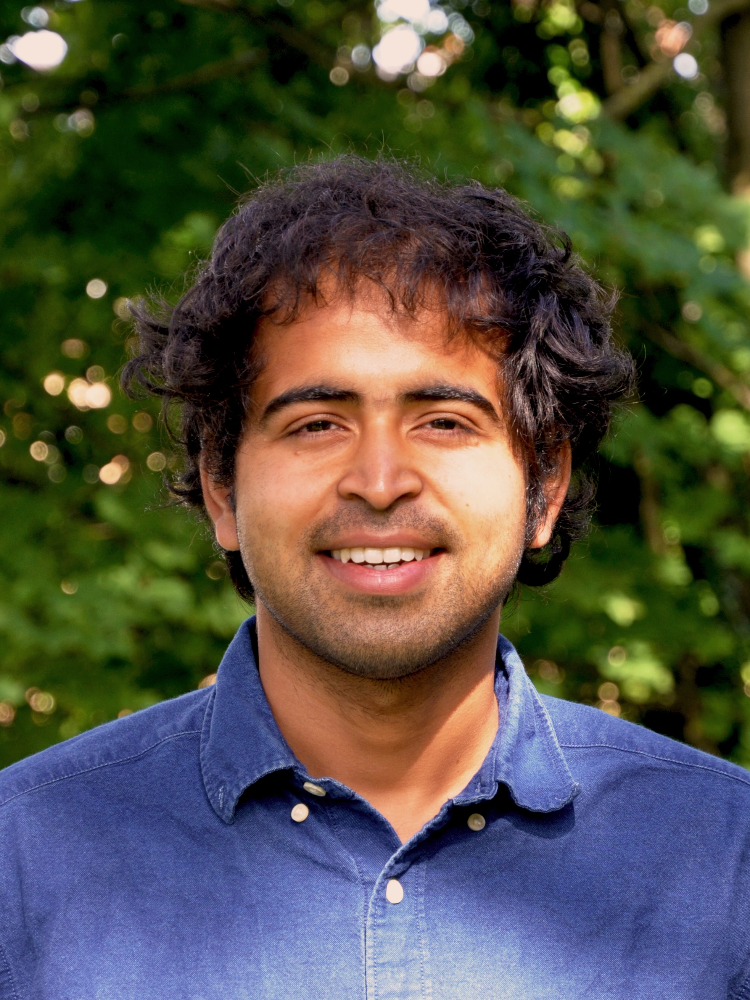

I am a PhD student in the van Nimwegen lab at the Biozentrum, where I develop Bayesian methods for the analysis of single-cell RNA-seq (scRNA-seq) datasets. My current research focuses on inferring gene regulatory networks from high-throughput omics data (## add link here). In addition, I have worked on benchmarking computational tools to help establish best practices for omics data analysis (## add link here). To learn more about our approach to scRNA-seq analysis, you can read our tutorial: [insert link here]. Broadly, I am interested in gene regulation and in developing computational methods for the analysis of high throughput and high dimensional biological datasets.

In another life I spent a couple of years analysing single cell and spatial transcriptomics datasets (## add link 1 and 2.) in neuroscience labs in EPFL and UNIL.

You can read about some of the topics that I use in my research or that piqued my interest in the [Notes](notes.qmd) section.

---

### Experience

**2023 --** PhD Student, Biozentrum, University of Basel

**2018 -- 23** Computational Biologist
- 2021 -- 23: UNIL, Lausanne
- 2019 -- 21: Remanalytics, Lausanne
- 2018 -- 19: La Manno Lab, Lausanne

---

### Education

**2018 -- 20** MSc Bioengineering, EPFL

**2016 -- 17** MTech Chemical Engineering, IIT Delhi

**2012 -- 16** BTech Chemical Engineering, IIT Delhi

---

### Publications

1. **Specialized astrocytes mediate glutamatergic gliotransmission in the CNS**\
   R De Ceglia, A Ledonne, DG Litvin, BL Lind, G Carriero, EC Latagliata, **A Ranjak**, et al.\
   *Nature*, 622 (7981), 120-129 (2023) — [DOI](https://doi.org/10.1038/s41586-023-06502-w)

2. **Spatial tissue profiling by imaging-free molecular tomography**\
   HH Schede, CG Schneider, J Stergiadou, LE Borm, **A Ranjak**, et al.\
   *Nature Biotechnology*, 39 (8), 968-977 (2021) — [DOI](https://doi.org/10.1038/s41587-021-00879-7)

---

### Contact

[anuragranjak@gmail.com](mailto:anuragranjak@gmail.com) / [LinkedIn](https://www.linkedin.com/in/anurag-ranjak-70872a56/)

